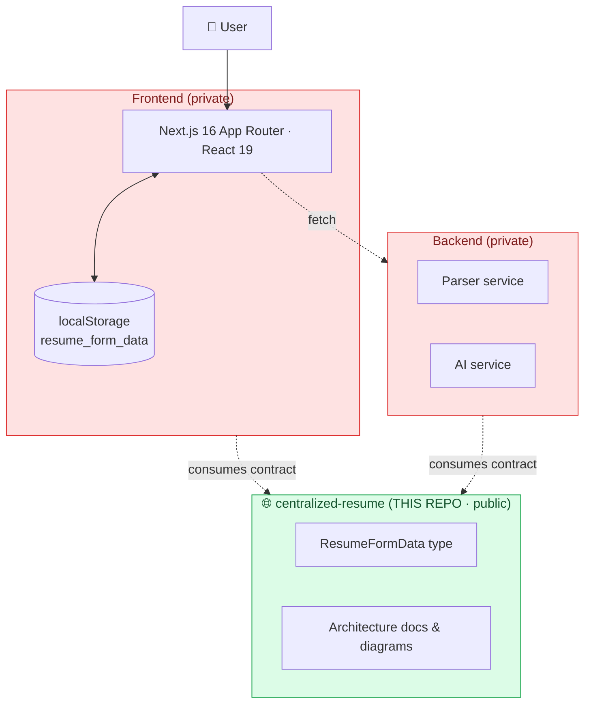
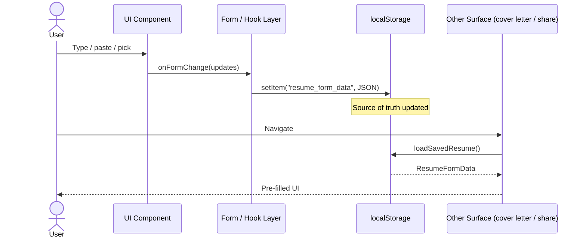

# Centralized Résumé

> The **public**, dependency‑free description of the data contract that every ResumeJe surface speaks. No secrets, no internal URLs, no API keys — just the shape of a résumé and a map of how the pieces fit together.

A shared résumé profile that follows the user across every ResumeJe surface — the structured builder, the upload/parse flow, the cover‑letter generator, the public share page, the templates marketplace, email/export flows, admin-safe operational surfaces, and future mobile / extension surfaces.

The "centralized résumé" is the single source of truth for a user's résumé data. Anything that needs résumé content — exports, AI prompts, scoring, share URLs, email drafts — reads from this profile.

---

## 🧱 The Data Model

```ts
interface ResumeFormData {
  profileImage?: string | null;
  fullName: string;
  jobTitle: string;
  email: string;
  phone: string;
  state: string;
  linkedin?: string;
  portfolio?: string;
  professionalSummary: string;
  education: EducationEntry[];
  experience: ExperienceEntry[];
  skills: { category: string; skills: string }[];
  certifications: string[];
  projects: ProjectEntry[];
  languages: string[];
}
```

The canonical implementation lives in the **private** `frontend` package at `src/app/types/resume.ts`. This public package mirrors the shape for downstream consumers (mobile apps, browser extensions, future integrations) without exposing any of the internal product code.

In‑browser persistence is via `localStorage` under the key `resume_form_data`. Helper signatures (`loadSavedResume`, `hasSavedResume`, `buildShortResumeSummary`) describe how every surface reads the centralized résumé. Export/email flows can transform the same data into PDF, DOCX, share links, and email-safe attachment payloads without changing the canonical contract.

---

## 🏛 Architecture Diagram

The centralized résumé is the **contract layer** in the middle of a three‑tier system:



### Surface map

Every consumer reads from and writes to the same `ResumeFormData` shape:

```mermaid
flowchart LR
    LS[("localStorage<br/>resume_form_data")]
    LS <--> R[/resume builder/]
    LS <-- parsed --- U[/upload + LinkedIn import/]
    LS --> C[/cover-letter generator/]
    LS --> T[/templates marketplace/]
    LS --> S[/u/[slug] share page/]
    LS --> E[Email résumé attachments]
    LS --> X[Export to PDF / DOCX]
    LS -.metadata only.-> A[/admin security review/]
```

An edit in the builder shows up immediately in the cover‑letter generator, the share page, and the templates marketplace — because all of them read the same key.

---

## ✅ What You Can Do With the Centralized Résumé

The centralized résumé powers every productive flow in ResumeJe:

- 📝 **Structured builder** (`/resume`) — live edit with auto‑save
- 📤 **Upload + parse** (`/upload`) — PDF / DOCX / TXT → `ResumeFormData`
- 🔗 **LinkedIn profile import** — populates the form from a pasted profile
- 🤖 **Live ATS score badge** — debounced scoring as you type
- 💡 **Skill suggestions** — job‑market dataset surfaces skills you're missing
- 📄 **Export to PDF** — formatted PDF output for download/email workflows
- 📄 **Export to DOCX** — zero‑dependency OOXML writer with email-safe spacing/pagination mode
- 🌐 **Public share page** (`/u/{slug}`) — base‑64 payload in the URL, no server needed
- 🛍 **Templates marketplace** (`/templates`) — pick a style, jump into builder pre‑filled
- ✍️ **Cover‑letter linker** — `/upload` and `/cover-letter` share the same résumé profile
- ✉️ **Email résumé flow** — generates email-ready résumé attachments/share context from the same profile data
- 🛡️ **Admin/security visibility** — admin tools may review metadata, delivery events, and audit trails, but should not alter the public résumé data contract

---

## 🔁 Lifecycle of a Single Edit



---

## 🚀 Future Extensions

- **Multi‑résumé profiles** — switch between résumés tailored to different roles
- **Cloud sync** via the private backend service
- **Version history** — every save snapshotted, easy rollback
- **Diff view** between two résumé versions
- **Stable public profile URL** that survives edits (instead of payload‑in‑URL)
- **Admin-reviewed operational metadata** for export/email/security events without exposing customer résumé content in public docs

---

## 🔐 Public Repo Policy

This package is **public**. By design it contains:

- ✅ The `ResumeFormData` shape
- ✅ Helper function signatures
- ✅ Architecture diagrams and documentation

It **never** contains:

- ❌ API keys, tokens, deploy secrets
- ❌ Internal URLs, hostnames, or environment configuration
- ❌ Proprietary prompt templates or scoring formulas
- ❌ Customer data, sample PII, or personal email addresses

If you're contributing to this package and you find yourself reaching for a value that would belong in a `.env` file — stop. That belongs in the private `frontend` or `backend` package instead.

---

## 📜 License

MIT
